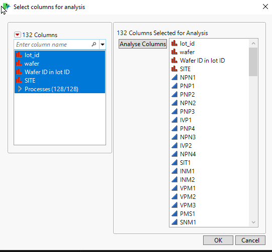
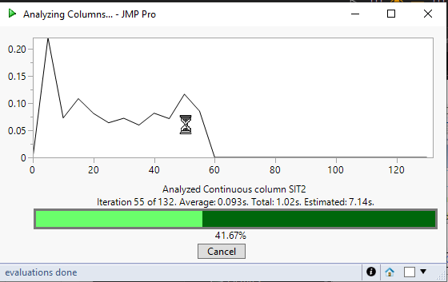
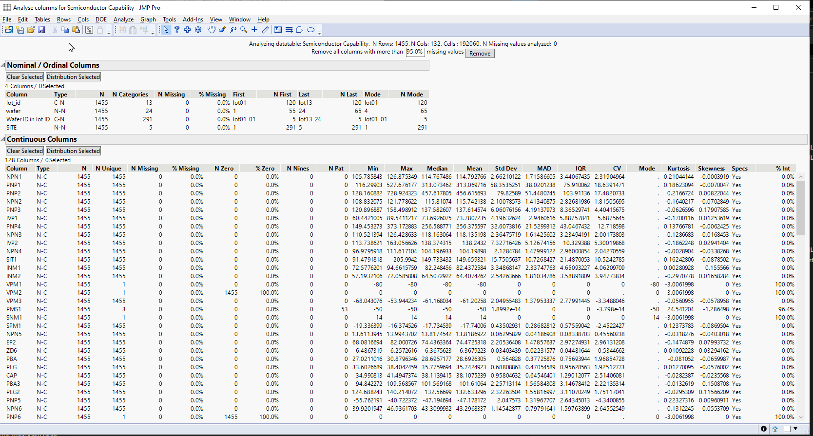
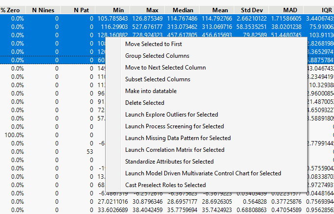

# Analyse Columns

Idea of analyse columns is to be first script you ran, when you get a new dataset. [Pandas Profiling](https://github.com/pandas-profiling/pandas-profiling) was inspiration for this **under-constuction** script.

Below are some images of the tool. As the tool is still work in progress the user-interface is very likely to change. Currently there are some issues when deleting columns and such (some of these problems are related to how JMP deletes row state handler when row is removed). 

### 1. Startup

### 2. ProgressBar during launch with working Cancel button

### 3. Analysis window

### 4. Right click menu options
